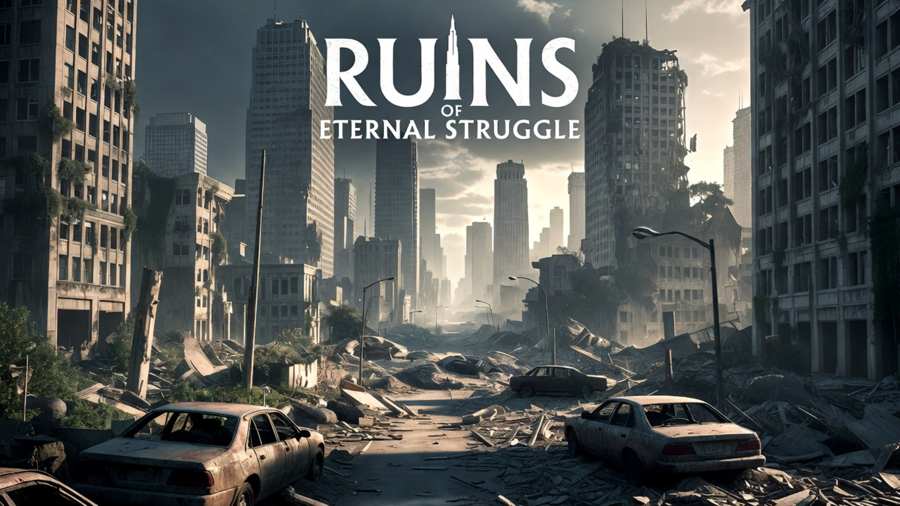

# Ruins of Eternal Struggle



**Ruins of Eternal Struggle** — форк [Cataclysm: The Last Generation](https://github.com/Cataclysm-TLG/Cataclysm-TLG), основанного на [Cataclysm: Dark Days Ahead](https://github.com/CleverRaven/Cataclysm-DDA).

Это однопользовательская пошаговая постапокалиптическая игра на выживание в мире, где мёртвые ходят, инопланетные ужасы бродят по земле, а ткань реальности порвалась. Несколько невезучих душ всё ещё выживают — суждено ли последнему поколению человечества вымереть или стать чем-то, способным выжить в этом дивном новом мире, зависит от вас.

## Особенности форка

- Кастомное главное меню с фоновой иллюстрацией
- Более казуальный баланс по умолчанию (замедленная эволюция монстров, пониженная плотность спавна)
- Потребности NPC в еде отключены по умолчанию
- Полноэкранный безрамочный режим окна по умолчанию
- Уникальные профессии и сценарии (см. ниже)
- **Ruins Echoes** — система атмосферных записок погибших выживших (см. ниже)
- Поддержка русской локализации
- Исправления ошибок

## Кастомные профессии и сценарии

Форк добавляет 6 уникальных профессий и 6 сценариев с полной русской локализацией.

### Профессии

| Профессия | Описание | Ключевые навыки |
|---|---|---|
| **Одинокий странник** (Lone Wanderer) | Бродяга-одиночка, выживающий в руинах с первого дня | Выживание, уклонение, ближний бой |
| **Последний страж** (Last Guardian) | Вооружённый защитник пустого убежища | Стрельба, пистолеты, ближний бой |
| **Заражённый выживший** (Infected Survivor) | Укушенный в первую волну, эксперт в самолечении | Первая помощь, кулинария, выживание |
| **Теневой мародёр** (Shadow Looter) | Ночной добытчик, мастер скрытности | Уклонение, механика, ловушки |
| **Медик руин** (Ruins Medic) | Бывший фельдшер, латающий раненых в руинах | Первая помощь (5), выживание |
| **Механик пустоши** (Wasteland Mechanic) | Мастер на все руки, чинит что угодно | Механика, крафт, электроника |

### Сценарии

| Сценарий | Очки | Старт |
|---|---|---|
| **Одинокий странник** | 0 | Заброшенное здание |
| **Последний страж** | 2 | Укреплённое убежище |
| **Заражённый выживший** | -4 | Койка больного (принуд. черта: Хлипкий) |
| **Теневой мародёр** | -1 | Тёмное здание |
| **Медик руин** | 1 | Импровизированная клиника |
| **Механик пустоши** | 0 | Старый гараж |

## Ruins Echoes

**Ruins Echoes** — система атмосферных записок погибших выживших. При обыске мебели в руинах офисов, домов и военных объектов существует шанс найти записку.

**40+ уникальных русскоязычных сообщений** трёх типов:

| Тип | Шанс | Описание |
|---|---|---|
| Атмосферные записи | 60% | Лор, дневники, последние мысли |
| Подсказки на лут | 30% | Записка + реальный предмет в той же мебели |
| Намёки на тайники | 10% | Описание существующих редких объектов мира |

Записки появляются в тумбочках, спальнях, офисных шкафах и военных локерах с шансом **12%**.

## Скачать

**Исходный код** — клонируйте репозиторий с GitHub:
```
git clone https://github.com/VirusAid/Ruins-of-Eternal-Struggle-.git
```

**Готовая сборка** — смотрите раздел [Releases](https://github.com/VirusAid/Ruins-of-Eternal-Struggle-/releases) на GitHub.

## Ссылки

- 💬 **Discord**: [https://discord.gg/8CHaDh2KTf](https://discord.gg/8CHaDh2KTf)
- Основан на: [Cataclysm: The Last Generation](https://github.com/Cataclysm-TLG/Cataclysm-TLG)
- Оригинальный проект: [Cataclysm: Dark Days Ahead](https://github.com/CleverRaven/Cataclysm-DDA)

## Лицензия

Ruins of Eternal Struggle распространяется под лицензией Creative Commons Attribution ShareAlike 3.0. Код и контент игры свободны для использования, модификации и распространения. См. https://creativecommons.org/licenses/by-sa/3.0/

Этот проект был бы невозможен без работы тысяч контрибьюторов [Cataclysm: The Last Generation](https://github.com/Cataclysm-TLG/Cataclysm-TLG) и оригинального [Cataclysm: Dark Days Ahead](https://github.com/CleverRaven/Cataclysm-DDA).

## FAQ

#### Есть ли обучение?

Да, в главном меню выберите **Обучение**. Также в игре нажмите `?` для доступа к документации.

#### Как изменить назначение клавиш?

Нажмите `?`, затем `1` для списка команд. Нажмите `+` чтобы добавить привязку.

#### Как создать новый мир?

В главном меню выберите **Мир** → **Создать мир**.
